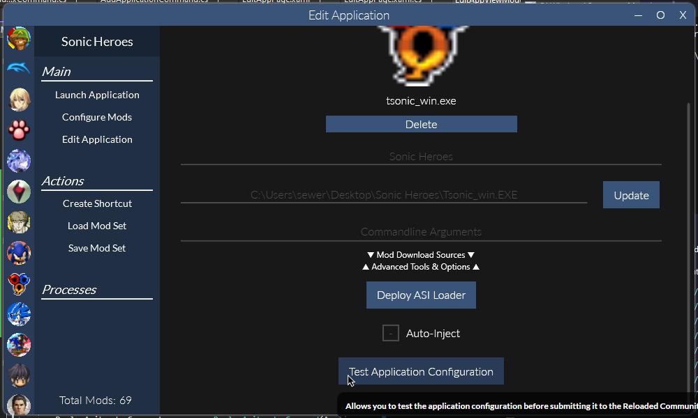

# Community Repository for Reloaded II

This repository provides various community managed configurations for different communities which use Reloaded-II. These configurations can be used to influence the behaviour of Reloaded-II's launcher when certain operations are performed, such as adding a new application to the launcher.

Most data for profiles can be autogenerated by using the `Reloaded.Community` tool. You can find this tool in the `Tools.zip` [download in the main Reloaded repository](https://github.com/Reloaded-Project/Reloaded-II/releases/latest).

## Applications

Profiles for various different applications can be found in the `Apps` folder. Each application has its own folder, which contains a `.json` file (or multiple, for different versions) with the application's settings.

### Generating Application Profiles

To get the list of available application profiles, run the following command from the command prompt.

```
Reloaded.Community.Tool.exe createTemplate --type Application
```

You may then create a profile template by using the following command:

```
Reloaded.Community.Tool.exe createTemplate --id tsonic_win.exe
```

Using an ID returned from the previous step. Once done, additional configuration data can be specified using the schema below.

### Application Schema

```json
{
  "Hash": "XXHASH64 of EXE Goes Here",
  "AppId": "application.id",
  "AppStatus": 0,
  "AppName": "Application Name",
  "Description": "Application Description",
  "GameBananaId": 1337,
  "Warnings": [
    {
      "ErrorMessage": "Sample Error",
      "Items": [
        {
          "Hash": "XXHASH64 Goes Here",
          "FilePath": "legit_folder/legit_file.zip"
        }
      ]
    }
  ]
}
```

### Main

| Item                  | Description                                                                                              |
|-----------------------|----------------------------------------------------------------------------------------------------------|
| Hash                  | Hash of main executable.                                                                                 |
| AppId                 | Unique ID of the application.                                                                            |
| AppStatus             | 0 = Valid. 1 = Invalid. If 1, shows warning in launcher. Use 1 for marking wrong EXEs in game folder(s). |
| AppName               | Name of the application. Overrides the auto generated name in Reloaded's launcher.                       |
| BadHashDescription    | Description shown for when game matches by ID but not by hash. (e.g. Good game, bad EXE)                 |
| BadStatusDescription  | A description shown if AppStatus is set to 1. Provide information about the potential issue here.        |
| GameBananaId          | Game ID for GameBanana. Available e.g. 6061 for https://gamebanana.com/games/6061                        |

In order to obtain hashes of files, use `Reloaded.Community.Tool.exe hash --source "PATH_TO_FILE"`.

### Warnings

Can be used to provide warnings for 3rd party components. e.g. Old DLL mods incompatible with Reloaded, Steam API Emulator DLLs, etc.

| Item         | Description                                            |
|--------------|--------------------------------------------------------|
| ErrorMessage | The error message to display if any files are matched. |
| Items        | [Warning Item(s) List of files to match against.       |


### Warning Item

| Item     | Description                                                            |
|----------|------------------------------------------------------------------------|
| Hash     | [Optional] Hash of the item.                                           |
| FilePath | Path of the file relative to the folder in which the EXE is contained. |

If the hash is provided, a warning will only be thrown if the file exists AND it matches the specified hash. If the hash is not provided, a warning will be thrown if the file exists. Use this to mark specific versions of files.

## Testing Configurations

You can test your created configurations by using the `Test Community Configuration` button under `Advanced Tools & Options`.  



## Contributing

Create an `Issue` with a new profile, or if you are more familiar with GitHub, a pull request.